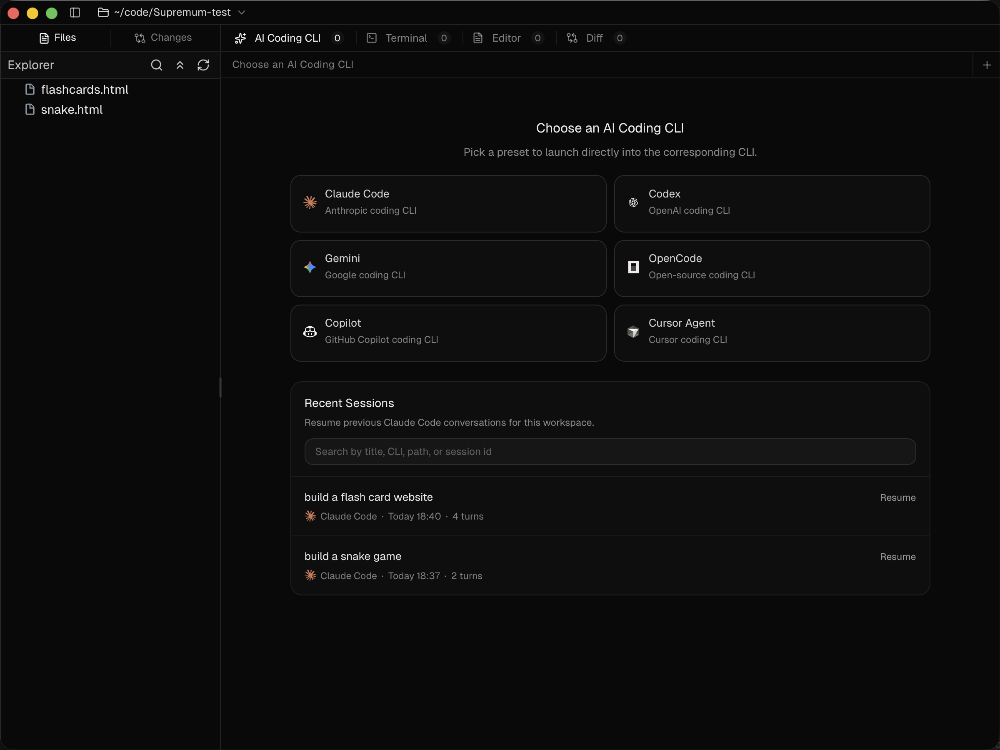

# Soren Superman



Soren Superman is a local desktop workspace for people who prefer real coding CLIs over browser chat boxes.

It keeps the terminal at the center, then adds the missing pieces around it: file browsing, editing, diffs, review surfaces, and faster context handoff into your coding assistant.

## What It Is

Soren Superman is built for a terminal-first workflow:

- Launch supported coding CLIs from a desktop app instead of wiring everything together manually
- Move from files to editor to terminal to diff without leaving the workspace
- Send files, folders, selections, and terminal output into AI sessions with fewer repetitive steps
- Keep multiple panes open when you want parallel CLI and terminal work

## Why People Use It

Traditional editors are powerful, but they can feel oversized when the actual work is happening in a shell.

Soren Superman takes the opposite approach:

- The terminal stays real
- Local files stay local
- The app acts like a lightweight control room around your CLI tools

## Current Focus

This project currently emphasizes:

- Claude Code session launch and resume workflows
- Fast local navigation across files, changes, and diffs
- Lightweight desktop packaging on macOS and Windows
- Windows startup behavior that opens the app directly without an extra console window

## Included Workspaces

- `AI Coding CLI`: start supported coding assistants and manage session-oriented work
- `Terminal`: run native shell sessions and forward selected output into assistant context
- `Editor`: inspect and edit files, including targeted code selection handoff
- `Files`: browse local repositories from an integrated file tree
- `Changes`: inspect repository modifications
- `Diff`: review code deltas in a dedicated workspace

## Supported CLI Launchers

The launcher currently includes presets for:

- Claude Code
- Codex
- Gemini
- OpenCode
- Copilot
- Cursor Agent

Some integrations are deeper than others. Claude Code currently has the richest session-oriented workflow support.

## Download

Latest builds are published on GitHub Releases:

- Repository: [Sett1a/soren-superman](https://github.com/Sett1a/soren-superman)
- Releases: [Download here](https://github.com/Sett1a/soren-superman/releases)

Current Windows release artifacts:

- `Soren.Superman_0.0.3_x64-setup.exe`
- `Soren.Superman_0.0.3_x64_en-US.msi`

## Quick Start

### Prerequisites

- [Bun](https://bun.sh/)
- Rust toolchain
- Tauri prerequisites for your platform
- The coding CLIs you want to launch available on `PATH`

### Install Dependencies

```bash
bun install
```

### Start Development Mode

```bash
bun run tauri dev
```

### Build the Frontend

```bash
bun run build
```

### Build Installers

```bash
bun run tauri build
```

Windows output paths:

- `src-tauri/target/release/bundle/nsis/Soren Superman_<version>_x64-setup.exe`
- `src-tauri/target/release/bundle/msi/Soren Superman_<version>_x64_en-US.msi`

macOS DMG helper commands:

- `bun run build:dmg:arm64`
- `bun run build:dmg:x64`
- `bun run build:dmg:universal`
- `bun run build:dmg:all`

## Platform Notes

### Windows

Release installers are not code-signed yet. If SmartScreen shows a warning, choose `More info` and then `Run anyway`.

This fork also includes a Windows packaging fix so the installed app opens as a GUI app instead of first spawning an extra terminal window.

### macOS

Release builds are not notarized yet. If macOS blocks the app after installation, remove quarantine:

```bash
xattr -dr com.apple.quarantine "/Applications/Soren Superman.app"
```

If the DMG itself is blocked before you can install, remove quarantine from the downloaded DMG and try again.

## Tech Stack

- Tauri 2
- React 19
- Vite
- xterm.js
- CodeMirror 6
- Rust backend services for PTY and file operations

## Project Status

The app is usable today, but it is still early-stage software.

Known limitations:

- Session resume is strongest for Claude Code
- Some launcher flows are preset-based rather than universally abstracted
- External CLIs must be installed separately by the user

## Origin And License

Soren Superman is a GPL-licensed fork derived from the Supremum project, with additional Windows packaging fixes, branding changes, and release work maintained in this repository.

License: [GNU GPL v3.0](./LICENSE)
